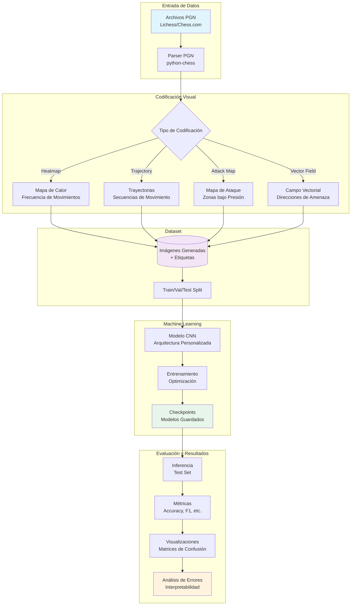

# Chess Stylometry - TFE

**Proyecto de Trabajo de Fin de Estudios (TFE) en Ingeniería de Telecomunicación**

Identificación de jugadores de ajedrez mediante análisis estilométrico basado en Redes Neuronales Convolucionales (CNN) y representaciones visuales de partidas.

---

## Descripción del Proyecto

Este proyecto investiga técnicas de **stylometry** (estilometría) aplicadas al ajedrez, con el objetivo de identificar jugadores basándose en patrones característicos de su estilo de juego. A diferencia de métodos tradicionales basados en características extraídas manualmente, utilizamos **representaciones visuales** de partidas como entrada para redes neuronales convolucionales.

### Motivación

La estilometría en ajedrez permite:
- **Identificación de jugadores**: Detectar la identidad de un jugador anónimo mediante su estilo
- **Análisis de patrones**: Descubrir patrones únicos en el juego de cada jugador
- **Detección de anomalías**: Identificar comportamientos inusuales o asistencia externa
- **Investigación en IA**: Explorar cómo las redes neuronales aprenden conceptos abstractos del ajedrez

### Enfoque Original

Basándonos en el paper de referencia `detection_stylometry.pdf`, exploramos enfoques innovadores que van más allá de la simple replicación:

1. **Mapas de calor de ataque de piezas**: Visualización de zonas del tablero bajo presión
2. **Flujo de movimiento**: Análisis temporal de trayectorias de piezas
3. **Proyecciones de posiciones futuras**: Representación de posibles movimientos futuros
4. **Campos vectoriales**: Visualización de direcciones y magnitudes de amenazas

Estos métodos permiten que la CNN aprenda patrones visuales sutiles que caracterizan el estilo de cada jugador.

---

## Objetivos

### Objetivos Principales

- [x] Diseñar e implementar un pipeline de procesamiento de partidas PGN
- [ ] Desarrollar múltiples codificaciones visuales de tableros de ajedrez
- [ ] Entrenar modelos CNN para clasificación de jugadores
- [ ] Evaluar precisión y generalización de los modelos
- [ ] Comparar diferentes representaciones visuales

### Objetivos Secundarios

- [ ] Crear visualizaciones interpretables de patrones aprendidos
- [ ] Analizar qué características del juego son más discriminativas
- [ ] Explorar transferencia de aprendizaje desde motores de ajedrez
- [ ] Implementar sistema de agentes para automatización de tareas

---

## Arquitectura del Sistema



### Estructura del Repositorio

```
jupyter/
├── docs/                          # Documentación y papers de referencia
│   ├── detection_stylometry.pdf   # Paper principal de referencia
│   └── chess_rating_estimation.pdf # Estimación de rating por IA
│
├── labs/                          # Código principal del proyecto
│   ├── dataset/                   # Datos de entrenamiento
│   │   ├── *.pgn                 # Archivos PGN originales
│   │   ├── generated/            # Imágenes generadas
│   │   └── splits/               # Train/Val/Test splits
│   │
│   ├── src/                      # Scripts de producción
│   │   ├── parsers/              # Parsers de PGN
│   │   ├── encoders/             # Generadores de codificación visual
│   │   ├── models/               # Definiciones de modelos CNN
│   │   └── training/             # Scripts de entrenamiento
│   │
│   ├── notebooks/                # Jupyter notebooks para exploración
│   │   └── chess-0000-preview.ipynb
│   │
│   ├── utils/                    # Utilidades y helpers
│   ├── models/                   # Checkpoints de modelos entrenados
│   └── output/                   # Resultados, gráficos, reportes
│
├── context/                      # Contexto del repositorio (sistema de agentes)
│   └── repo_context.json
│
├── agent_cli.py                  # Sistema CLI de agentes
├── agents.py                     # Wrapper de comandos de agentes
├── Makefile                      # Automatización de tareas
│
└── *.md                          # Documentación del proyecto
    ├── README.md                 # Este archivo
    ├── AGENTS.md                 # Reglas de desarrollo
    ├── ARCHITECT.md              # Agente de arquitectura
    ├── QUICKSTART.md             # Guía rápida
    └── architecture.md           # Documentación de arquitectura
```

---

##  Metodología

### 1. Recolección de Datos

**Fuentes de datos**:
- Lichess Database (partidas de jugadores específicos)
- Chess.com (perfiles públicos)
- Criterios: Jugadores con >100 partidas, diferentes niveles de ELO

### 2. Codificaciones Visuales (Enfoques Innovadores)

#### A) Mapa de Calor de Movimientos
Representa la frecuencia de ocupación de cada casilla por las piezas del jugador.

```python
# Ejemplo conceptual
heatmap[square] += visit_frequency
# Resultado: Imagen 8x8 normalizada
```

#### B) Mapa de Ataque/Presión
Visualiza qué casillas están bajo ataque y con qué intensidad.

```python
# Ejemplo conceptual
attack_map[square] = sum(piece_attacks_to_square)
# Incluye: dirección, tipo de pieza atacante
```

#### C) Trayectorias Temporales
Secuencias de movimientos representadas como paths en el tablero.

```python
# Ejemplo conceptual
trajectory_img = overlay_moves(board_sequence)
# Codificación de color por tiempo
```

#### D) Campo Vectorial de Amenazas
Representación vectorial de direcciones de ataque.

```python
# Ejemplo conceptual
vector_field[square] = (magnitude, direction)
# Visualizado como quiver plot
```

### 3. Arquitectura de Red Neuronal

**CNN Propuesta** (sujeta a experimentación):

```
Input: (64x64x3) o (8x8xN) depending on encoding
├── Conv2D (32 filters, 3x3) + ReLU + BatchNorm
├── MaxPool2D (2x2)
├── Conv2D (64 filters, 3x3) + ReLU + BatchNorm
├── MaxPool2D (2x2)
├── Conv2D (128 filters, 3x3) + ReLU + BatchNorm
├── GlobalAveragePooling2D
├── Dense (256) + ReLU + Dropout(0.5)
├── Dense (128) + ReLU + Dropout(0.3)
└── Dense (num_players) + Softmax
```

**Variantes a explorar**:
- ResNet adaptado
- Vision Transformer (ViT)
- Ensemble de múltiples codificaciones

### 4. Entrenamiento

- **Optimizador**: Adam (lr=0.001 con decay)
- **Loss**: Categorical Crossentropy
- **Métricas**: Accuracy, F1-Score macro, Top-3 Accuracy
- **Regularización**: Dropout, BatchNorm, Data Augmentation
- **Early Stopping**: Paciencia de 20 épocas en validation loss

### 5. Evaluación

- **Métricas cuantitativas**: Accuracy, Precision, Recall, F1, AUC-ROC
- **Análisis cualitativo**: Matrices de confusión, t-SNE de embeddings
- **Interpretabilidad**: Grad-CAM para visualizar qué partes del tablero son relevantes

---

## 🚀 Instalación y Uso

### Requisitos Previos

- Python 3.12+
- pip y virtualenv
- (Opcional) CUDA para entrenamiento en GPU

### Instalación

```bash
# Clonar repositorio
git clone <repository-url>
cd jupyter

# Crear entorno virtual
python3 -m venv venv
source venv/bin/activate  # En Windows: venv\Scripts\activate

# Instalar dependencias
pip install -r requirements.txt  # (crear este archivo con las dependencias)
```

### Dependencias Principales

```
python-chess>=1.9.0
numpy>=1.24.0
pandas>=2.0.0
matplotlib>=3.7.0
seaborn>=0.12.0
torch>=2.0.0  # o tensorflow>=2.12.0
scikit-learn>=1.3.0
jupyter>=1.0.0
cairosvg>=2.7.0
```

### Inicio Rápido

```bash
# Inicializar sistema de agentes
make init

# Ver agentes disponibles
make list

# Ejecutar notebook de exploración
jupyter notebook labs/notebooks/chess-0000-preview.ipynb

# (Futuro) Generar codificaciones visuales
python labs/src/encoders/generate_heatmaps.py --input dataset/ --output dataset/generated/

# (Futuro) Entrenar modelo
python labs/src/training/train_cnn.py --encoder heatmap --epochs 100
```

---

## 📊 Resultados Esperados

### Hipótesis

1. **Diferentes codificaciones capturan diferentes aspectos del estilo**
   - Heatmaps: Preferencias posicionales
   - Trayectorias: Patrones tácticos
   - Mapas de ataque: Agresividad/defensa

2. **La CNN puede aprender patrones no evidentes para humanos**
   - Sutilezas en la distribución de piezas
   - Tendencias en estructuras de peones
   - Preferencias de desarrollo

3. **El rendimiento depende del número de partidas por jugador**
   - Mínimo 50 partidas para generalización
   - Óptimo >200 partidas

### Métricas Objetivo

| Métrica | Objetivo Mínimo | Objetivo Ideal |
|---------|----------------|----------------|
| Accuracy (10 jugadores) | 60% | 80%+ |
| Accuracy (50 jugadores) | 30% | 50%+ |
| F1-Score macro | 0.55 | 0.75+ |
| Top-3 Accuracy | 80% | 90%+ |

---

## 🔧 Sistema de Agentes

Este proyecto incluye un sistema de agentes automatizados para facilitar tareas repetitivas.

### Comandos Disponibles

```bash
make help      # Ver ayuda
make init      # Inicializar contexto del repositorio
make list      # Listar agentes disponibles
make agent NAME=<nombre>  # Ejecutar agente específico
```

### Agentes Actuales

- **architect**: Responsable de arquitectura del sistema y documentación

Ver [QUICKSTART.md](QUICKSTART.md) para más información sobre el sistema de agentes.

---

## Referencias y Fundamentos Teóricos

### Papers Principales

1. **`detection_stylometry.pdf`** - Detección de estilo en ajedrez mediante ML
   - Base teórica principal del proyecto
   - Métodos de feature extraction
   - Resultados de referencia

2. **`chess_rating_estimation.pdf`** - Estimación de rating mediante IA
   - Técnicas de evaluación de posiciones
   - Conexión entre estilo y nivel de juego

### Conceptos Clave

- **Stylometry**: Análisis de estilo de escritura/juego para identificación de autoría
- **CNN (Convolutional Neural Networks)**: Redes especializadas en procesamiento de imágenes
- **Feature Learning**: Aprendizaje automático de características relevantes
- **Transfer Learning**: Aprovechamiento de conocimiento pre-entrenado

---

## 🗺️ Roadmap del Proyecto

### Fase 1: Preparación (Semanas 1-2) 
- [x] Configuración del repositorio
- [x] Sistema de agentes
- [x] Documentación inicial
- [x] Recopilación de papers de referencia

### Fase 2: Desarrollo de Pipeline (Semanas 3-5)
- [ ] Implementar parsers de PGN
- [ ] Desarrollar generadores de codificaciones visuales
- [ ] Crear dataset splits
- [ ] Validar calidad de datos

### Fase 3: Experimentación (Semanas 6-9)
- [ ] Entrenar modelos baseline
- [ ] Probar diferentes codificaciones
- [ ] Optimizar hiperparámetros
- [ ] Comparar arquitecturas

### Fase 4: Evaluación y Análisis (Semanas 10-11)
- [ ] Evaluación exhaustiva en test set
- [ ] Análisis de interpretabilidad
- [ ] Comparación con estado del arte
- [ ] Documentación de resultados

### Fase 5: Documentación Final (Semana 12)
- [ ] Redacción de memoria técnica
- [ ] Preparación de presentación
- [ ] Limpieza de código
- [ ] Release final

---

##  Contribuciones y Desarrollo

### Reglas de Desarrollo

Este proyecto sigue estándares estrictos de código. Ver [AGENTS.md](AGENTS.md) para las reglas completas:

- **Naming**: `snake_case` para variables/funciones, `SCREAMING_SNAKE_CASE` para constantes
- **Documentación**: Docstrings NumPy/Google style obligatorios
- **Typing**: Type annotations explícitas en funciones públicas
- **Testing**: Unit tests para toda función expuesta
- **Error Handling**: Errores con prefijo `[COMPONENT_NAME]`

### Workflow de Git

```bash
# Crear rama para nueva feature
git checkout -b feature/nueva-funcionalidad

# Hacer commits descriptivos
git commit -m "feat: Implementar generador de mapas de calor"

# Push y crear PR
git push origin feature/nueva-funcionalidad
```

---

## Licencia

Este proyecto es un Trabajo de Fin de Estudios académico. 

**Autor**: André Yermak Naumenko
**Universidad**: Universidad Politécnica de Cartagena
**Grado**: Ingeniería Telemática
**Año**: 2025

---
##  Notas de Desarrollo

### Estado Actual del Proyecto

- [x] Estructura del repositorio inicializada
- [x] Sistema de agentes funcional
- [x] Documentación base creada
- [ ] Pipeline de datos en desarrollo
- [ ] Modelos en fase de diseño

### Próximos Pasos Inmediatos

1. Implementar parser de PGN robusto
2. Crear primer generador de heatmaps
3. Recopilar dataset inicial (5-10 jugadores, 100 partidas c/u)
4. Entrenar modelo baseline simple

---

**Última actualización**: Octubre 2025
**Versión del documento**: 1.1

