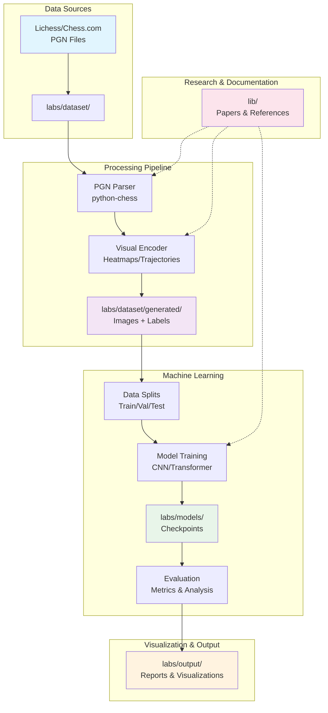
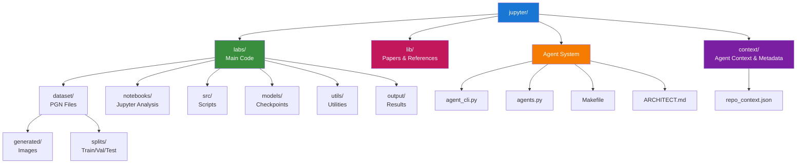
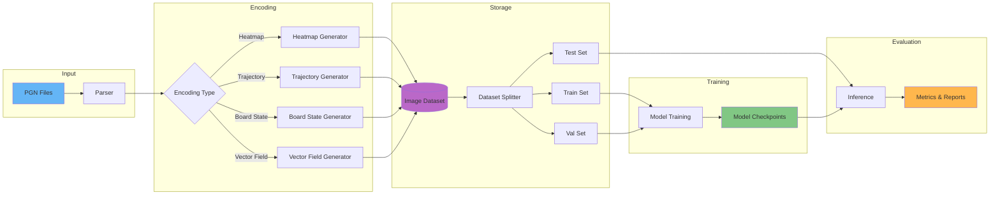
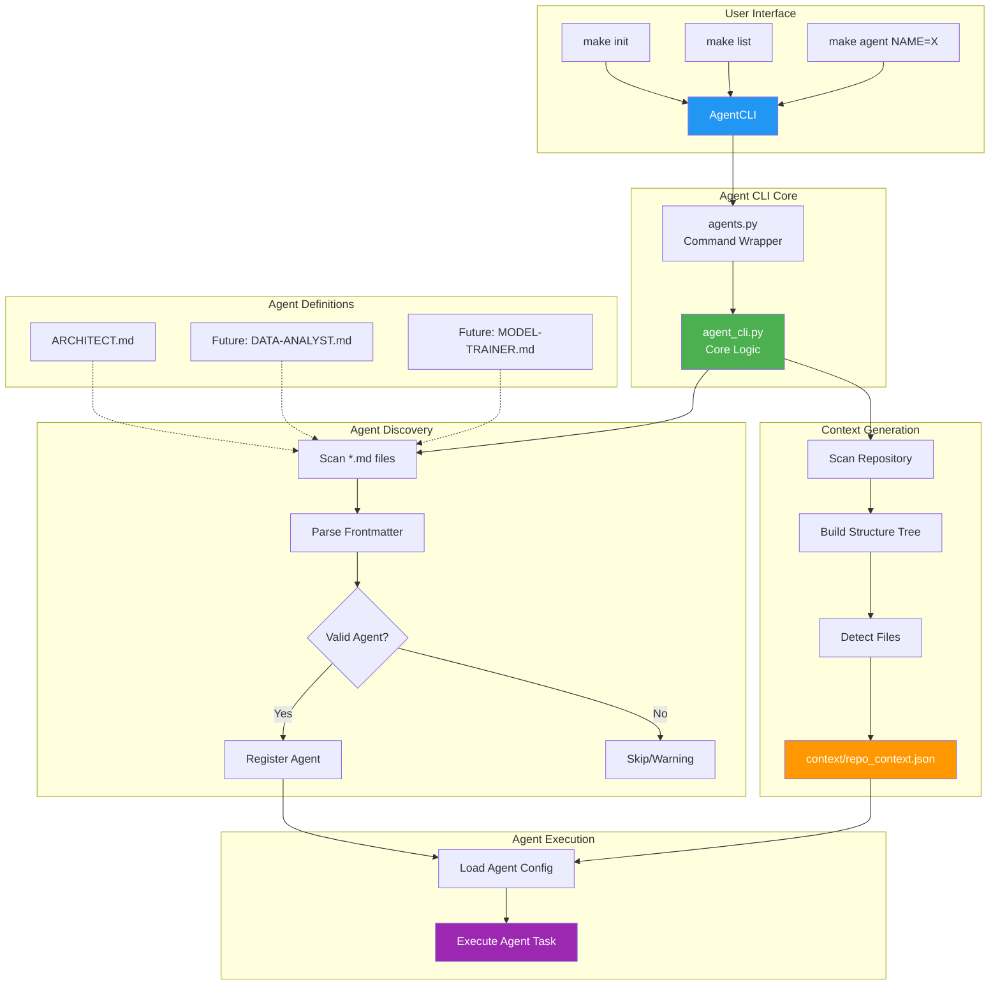
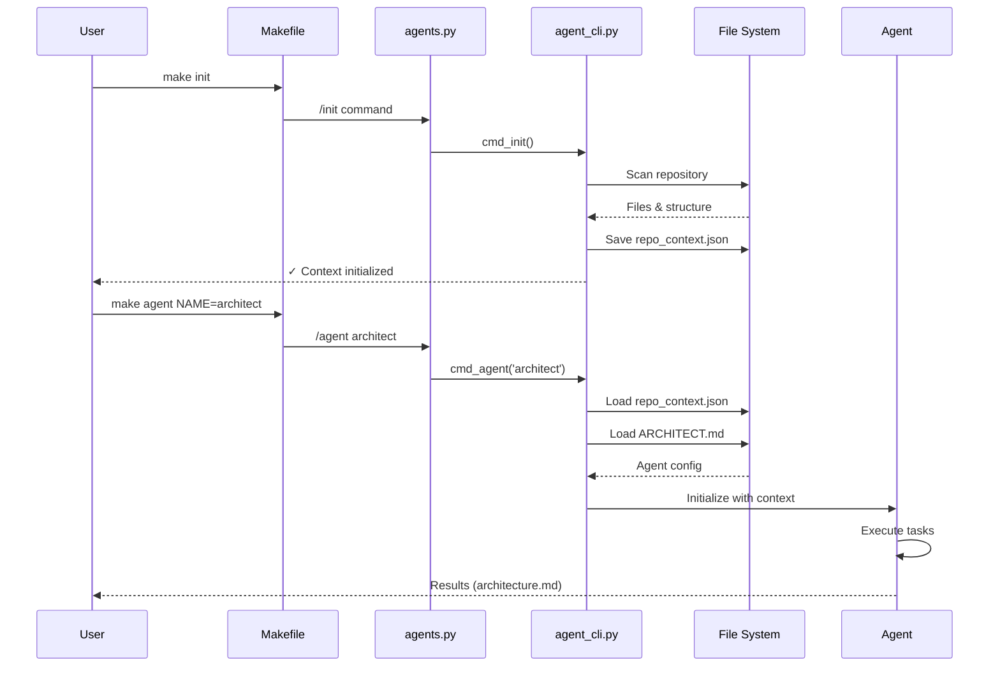
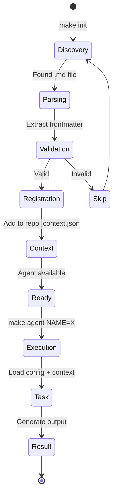

# Architecture Document - Chess Stylometry TFE

**Generated by**: architect-agent  
**Date**: 2024-10-08  
**Version**: 1.0  
**Model**: Opus

---

## Executive Summary

This document describes the architecture of the Chess Stylometry TFE project, a telecommunications engineering final project focused on AI-driven chess pattern analysis. The system analyzes chess games to identify players based on their characteristic play patterns (stylometry) through visual encodings and machine learning models.

## Table of Contents

1. [System Overview](#system-overview)
2. [Architecture Diagrams](#architecture-diagrams)
3. [Component Descriptions](#component-descriptions)
4. [Data Flow](#data-flow)
5. [Technology Stack](#technology-stack)
6. [Agent System](#agent-system)
7. [Development Workflow](#development-workflow)
8. [Future Extensions](#future-extensions)

---

## System Overview

The Chess Stylometry project implements a pipeline for:

1. **Data Ingestion**: Processing PGN (Portable Game Notation) chess game files
2. **Feature Extraction**: Converting game moves into visual representations (heatmaps, trajectories, board states)
3. **Model Training**: Training CNN/Transformer models to identify players from anonymized games
4. **Evaluation**: Assessing identification accuracy and analyzing patterns

The architecture follows a modular design with clear separation between data processing, visualization, modeling, and agent automation.

---

## Architecture Diagrams

### High-Level System Architecture



### Repository Structure



### Data Flow Architecture



### Agent System Architecture



### Component Interaction



---

## Component Descriptions

### Core Modules

#### 1. **Data Layer** (`labs/dataset/`)

**Purpose**: Storage and organization of chess game data

**Components**:
- `chessgame0001.pgn`: Raw PGN game files
- `generated/`: Processed visual representations (images)
- `splits/`: Train/validation/test data partitions

**Technologies**: File system, PGN format

#### 2. **Processing Layer** (`labs/src/`, `labs/notebooks/`)

**Purpose**: Data parsing, feature extraction, and visualization

**Components**:
- PGN parsers (python-chess)
- Visual encoding generators
- Jupyter notebooks for experimentation (`chess-0000-preview.ipynb`)

**Technologies**: 
- Python 3.12
- python-chess
- numpy, pandas
- matplotlib, cairosvg

#### 3. **Model Layer** (`labs/models/`)

**Purpose**: Machine learning model definitions and checkpoints

**Components**:
- CNN architectures for image classification
- Transformer models for sequence analysis
- Trained model checkpoints

**Technologies**: 
- PyTorch / TensorFlow (to be determined)
- Scikit-learn for utilities

#### 4. **Output Layer** (`labs/output/`)

**Purpose**: Generated visualizations, reports, and evaluation results

**Components**:
- Training plots and metrics
- Confusion matrices
- Stylometric fingerprint visualizations

#### 5. **Agent System** (`agent_cli.py`, `agents.py`, `Makefile`)

**Purpose**: Automated task execution and repository management

**Components**:
- **agent_cli.py** (367 lines): Core CLI with agent discovery, parsing, and context generation
- **agents.py** (58 lines): Simplified command wrapper
- **Makefile**: Convenient command shortcuts
- **context/repo_context.json**: Generated repository metadata

**Key Features**:
- Auto-discovery of agents from `.md` files
- Frontmatter YAML parsing
- Repository context generation
- Validation and error handling

**Current Agents**:
- `architect`: System architecture analysis and documentation

#### 6. **Research Library** (`lib/`)

**Purpose**: Reference materials and research papers

**Resources**:
- `chess_rating_estimation.pdf`
- `detection_stylometry.pdf`

---

## Data Flow

### 1. Ingestion Phase

```
PGN Files → Parser → Structured Game Data
```

**Input**: Raw PGN files from Lichess/Chess.com  
**Processing**: Parse moves, metadata, player info  
**Output**: Structured game objects

### 2. Encoding Phase

```
Structured Data → Visual Encoders → Images
```

**Encodings**:
- **Heatmaps**: Piece movement frequency
- **Trajectories**: Move sequence paths
- **Board States**: Position snapshots
- **Vector Fields**: Directional movement patterns

### 3. Training Phase

```
Images + Labels → Dataset Splits → Model Training → Checkpoints
```

**Process**:
1. Split data (70/15/15 train/val/test)
2. Apply data augmentation
3. Train CNN/Transformer models
4. Save checkpoints and metrics

### 4. Evaluation Phase

```
Test Set + Model → Inference → Metrics + Visualizations
```

**Outputs**:
- Accuracy, precision, recall, F1
- Confusion matrices
- Error analysis
- Stylometric comparisons

---

## Technology Stack

### Programming Languages
- **Python 3.12**: Primary language

### Data Processing
- **python-chess**: PGN parsing and chess logic
- **pandas**: Tabular data manipulation
- **numpy**: Numerical operations

### Visualization
- **matplotlib**: Plotting and charting
- **seaborn**: Statistical visualizations
- **cairosvg**: SVG to PNG conversion

### Machine Learning
- **PyTorch / TensorFlow**: Deep learning frameworks (TBD)
- **scikit-learn**: ML utilities and metrics

### Development Tools
- **Jupyter**: Interactive notebooks
- **Git**: Version control
- **Make**: Build automation

### Agent System
- **Python stdlib**: argparse, pathlib, json, re, dataclasses
- **Type annotations**: PEP 484 compliance
- **Frontmatter parsing**: Custom YAML parser

---

## Agent System

### Architecture Pattern

The agent system follows a **Plugin Architecture** pattern:

1. **Discovery**: Agents are discovered by scanning `.md` files in the repository root
2. **Registration**: Valid agents with proper frontmatter are registered
3. **Execution**: Agents are loaded with full context and executed on demand

### Agent Definition Format

```markdown
---
name: agent-name
description: Agent description
model: opus|sonnet|haiku
tools: tool1, tool2, tool3
---

Agent documentation and instructions here.
```

### Agent Lifecycle



### Current Agents

#### architect-agent
- **Model**: Opus (high-capacity)
- **Tools**: code-search, repo-analyzer, Mermaid
- **Purpose**: Analyze repository architecture and generate documentation
- **Output**: This architecture.md document

### Future Agents (Planned)

#### data-analyst-agent
- **Model**: Sonnet
- **Tools**: pandas, numpy, matplotlib
- **Purpose**: Analyze PGN datasets and generate statistical reports

#### model-trainer-agent
- **Model**: Sonnet
- **Tools**: PyTorch, scikit-learn
- **Purpose**: Train and evaluate chess stylometry models

#### visualizer-agent
- **Model**: Haiku
- **Tools**: matplotlib, seaborn
- **Purpose**: Generate visual encodings from PGN data

---

## Development Workflow

### 1. Research Phase
- Review papers in `lib/`
- Explore encoding strategies
- Design experiments

### 2. Data Preparation
- Collect PGN files → `labs/dataset/`
- Parse and validate games
- Generate visual encodings → `labs/dataset/generated/`

### 3. Experimentation
- Prototype in Jupyter notebooks → `labs/notebooks/`
- Iterate on encodings and features
- Visualize results

### 4. Production Scripts
- Convert notebooks to Python scripts → `labs/src/`
- Implement utilities → `labs/utils/`
- Automate pipeline

### 5. Model Development
- Define model architectures
- Train on prepared datasets
- Save checkpoints → `labs/models/`

### 6. Evaluation
- Run inference on test set
- Generate metrics and reports
- Save outputs → `labs/output/`

### 7. Agent Automation
- Use `make init` to update context
- Use `make agent NAME=X` to automate tasks
- Extend with new agents as needed

---

## Future Extensions

### Short Term
1. **Data Pipeline Automation**
   - Create data-analyst agent for PGN analysis
   - Automate encoding generation

2. **Model Training Automation**
   - Implement model-trainer agent
   - Hyperparameter tuning workflows

3. **Visualization Enhancement**
   - Create visualizer agent
   - Interactive dashboards

### Medium Term
1. **Advanced Encodings**
   - Stacked trajectories
   - Vector field representations
   - Temporal heatmaps

2. **Model Diversity**
   - Transformer-based models
   - Ensemble methods
   - Transfer learning from chess engines

3. **Agent Ecosystem**
   - More specialized agents
   - Agent collaboration patterns
   - Automated testing agents

### Long Term
1. **Web Interface**
   - Flask/FastAPI backend
   - React frontend
   - Real-time analysis

2. **Distributed Training**
   - Multi-GPU support
   - Cloud deployment
   - Scalable pipelines

3. **Production Deployment**
   - API endpoints
   - Model serving
   - Continuous learning

---

## Appendix

### File Statistics

| Category | Count | Details |
|----------|-------|---------|
| Python Files | 2 | agent_cli.py (367 lines), agents.py (58 lines) |
| Notebooks | 1 | chess-0000-preview.ipynb |
| Agents | 1 | architect |
| PGN Files | 1 | chessgame0001.pgn |
| Papers | 2 | chess_rating_estimation.pdf, detection_stylometry.pdf |
| Key Directories | 10 | Full project structure |

### Repository Metrics

- **Total Lines of Agent Code**: 425 lines
- **Documentation Files**: 7 (README, AGENTS, ARCHITECT, AGENT_CLI, QUICKSTART, EJEMPLO_USO, this document)
- **Agent System Version**: 1.0
- **Python Version**: 3.12
- **Repository Type**: Research & Development

### Context File Structure

```json
{
  "repo_root": "/path/to/jupyter",
  "structure": { /* directory tree */ },
  "agents": { /* registered agents */ },
  "metadata": {
    "python_files": [],
    "notebooks": [],
    "key_directories": []
  }
}
```

---

## Conclusion

The Chess Stylometry TFE project implements a well-structured, modular architecture for analyzing chess playing patterns through visual encodings and machine learning. The addition of an agent system enables automated task execution and improves development workflow efficiency.

**Key Strengths**:
- ✅ Clear separation of concerns
- ✅ Modular, extensible design
- ✅ Automated agent system
- ✅ Comprehensive documentation
- ✅ Research-backed approach

**Next Steps**:
1. Implement data processing pipeline
2. Create additional agents (data-analyst, model-trainer)
3. Train initial CNN models
4. Evaluate and iterate

---

**Document Generated by**: architect-agent  
**Tools Used**: code-search, repo-analyzer, Mermaid  
**Model**: Opus  
**Date**: 2025-10-08
