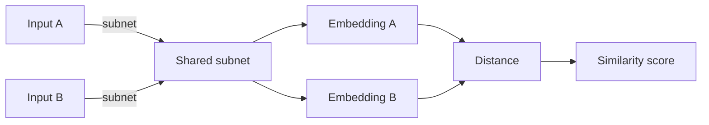
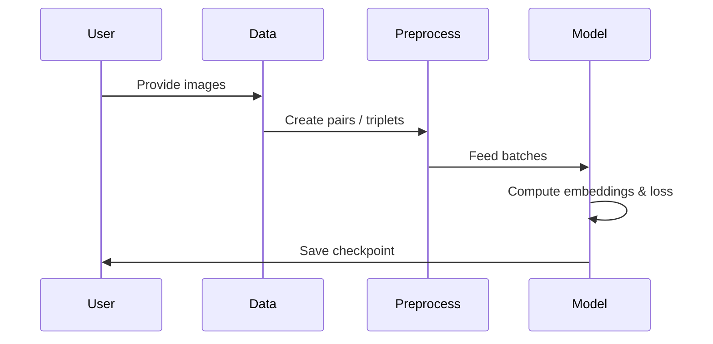

# Redes Siamese (Siamese Neural Networks)

Este documento sintetiza y organiza la información provista sobre redes siamese: qué son, cuándo usarlas, arquitectura, funciones de pérdida (contrastive y triplet), ejemplos de implementación, mejoras, casos de uso y buenas prácticas.

## Índice

- Resumen
- Caso de uso (attendance, verificación de firma)
- Arquitectura
- Funciones de pérdida
  - Contrastive loss
  - Triplet loss
- Implementación: ejemplo con Keras (TensorFlow)
- Mejora y recomendaciones
- Pros y contras
- Buenas prácticas y pruebas
- Diagramas (Mermaid)

## Resumen

Las redes siamese son arquitecturas diseñadas para medir la similitud entre dos (o más) entradas. En lugar de aprender a clasificar entradas en un conjunto fijo de clases, la red aprende una función de similitud (o embedding) que acerca ejemplos similares y separa ejemplos disímiles en el espacio de representación.

Esto facilita problemas de "one-shot learning" donde hay pocas muestras por clase y la cantidad de clases puede crecer con el tiempo.

## Casos de uso

- Sistema de asistencia por reconocimiento facial (employee attendance)
- Verificación de firmas
- Búsqueda por similitud (image retrieval)
- Emparejamiento de documentos o medidas semánticas

## Arquitectura

Una red siamese típica contiene dos (o más) sub-redes con la misma arquitectura y pesos (weights compartidos). Cada sub-red genera un embedding (vector) para su entrada; finalmente se compara la distancia entre embeddings para producir una puntuación de similitud.

Mermaid: flujo simple de la arquitectura



## Funciones de pérdida

### Contrastive loss

Contrastive loss distingue pares similares y disimilares. Dada una pareja (x1, x2) con etiqueta y (y=0 si similares, y=1 si disimilares), y la distancia euclidiana D_W entre embeddings, la pérdida es:

\[ L = (1 - y) * D_W^2 + y * max(0, m - D_W)^2 \]

- D_W: distancia Euclidiana entre embeddings
- m: margen (margin), escala positiva que define cuándo pares disímiles no contribuyen a la pérdida

### Triplet loss

Triplet loss usa tripletas (anchor, positive, negative). El objetivo es que la distancia entre anchor y positive sea menor que la distancia entre anchor y negative por, al menos, una constante margin.

\[ L = max(0, d(a, p) - d(a, n) + margin) \]

- d(): distancia (L2 o coseno) entre embeddings
- margin: hiperparámetro para separar positivos y negativos

## Implementación: ejemplo con Keras (TensorFlow)

A continuación un ejemplo mínimo de red siamese con Keras que ilustra el flujo, la arquitectura del embedding y la definición de una pérdida contrastiva y triplet.

### Dependencias (sugeridas)

- tensorflow>=2.10
- numpy

### 1) Backbone (subnet) y función de distancia

```python
import tensorflow as tf
from tensorflow.keras import layers, Model
import numpy as np


def create_backbone(input_shape=(128, 128, 3), embedding_dim=128) -> Model:
    inputs = layers.Input(shape=input_shape)
    x = layers.Conv2D(32, 3, activation='relu')(inputs)
    x = layers.MaxPool2D()(x)
    x = layers.Conv2D(64, 3, activation='relu')(x)
    x = layers.MaxPool2D()(x)
    x = layers.Flatten()(x)
    x = layers.Dense(256, activation='relu')(x)
    outputs = layers.Dense(embedding_dim)(x)  # embedding sin activación final
    return Model(inputs, outputs, name='backbone')


def l2_distance(a: tf.Tensor, b: tf.Tensor) -> tf.Tensor:
    return tf.sqrt(tf.reduce_sum(tf.square(a - b), axis=-1) + 1e-8)
```

### 2) Modelo siamese para entrenamiento contrastive

```python
# Entrenamiento contrastive: input pares (x1, x2) y etiquetas y (0=sim, 1=dis)
input_shape = (128, 128, 3)
backbone = create_backbone(input_shape, embedding_dim=128)

input_a = layers.Input(shape=input_shape)
input_b = layers.Input(shape=input_shape)

embed_a = backbone(input_a)
embed_b = backbone(input_b)

dist = l2_distance(embed_a, embed_b)

model = Model([input_a, input_b], dist)

# Pérdida contrastive personalizada
margin = 1.0

@tf.function
def contrastive_loss(y_true, y_pred):
    # y_true: 0 similar, 1 dissimilar
    y_true = tf.cast(y_true, y_pred.dtype)
    positive_loss = (1 - y_true) * tf.square(y_pred)
    negative_loss = y_true * tf.square(tf.maximum(0., margin - y_pred))
    return tf.reduce_mean(positive_loss + negative_loss)

model.compile(optimizer='adam', loss=contrastive_loss)
```

### 3) Triplet training (esquema simplificado)

Para triplet loss se suele entrenar con batch construction que incluye anclas, positivos y negativos. Aquí se muestra una función de pérdida:

```python
@tf.function
def triplet_loss(a, p, n, margin=0.2):
    d_ap = tf.reduce_sum(tf.square(a - p), axis=-1)
    d_an = tf.reduce_sum(tf.square(a - n), axis=-1)
    loss = tf.maximum(0., d_ap - d_an + margin)
    return tf.reduce_mean(loss)
```

Para entrenar con triplets se puede crear un modelo que tome tres inputs y devuelva embeddings, o construir un loop de entrenamiento personalizado.

## Mejora y recomendaciones

- Sampling: seleccionar ejemplos duros (hard negatives) para triplets mejora el aprendizaje.
- Pérdidas avanzadas: angular loss, lifted structured loss y otras técnicas de metric learning.
- Data augmentation y normalización son clave para robustez.

## Pros y contras

Pros:
- Robusto a clases con pocos ejemplos (one-shot)
- Aprende embeddings útiles para tareas de retrieval

Contras:
- Requiere mayor tiempo de entrenamiento (pares/tripletas)
- No devuelve probabilidades directas; devuelve distancias o scores

## Buenas prácticas y pruebas

- Mantener tipado y docstrings claros
- Pruebas unitarias para funciones de preprocesado, generación de pares/tripletas y funciones de pérdida
- CI con linters y type-check (mypy)

## Diagramas y flujo de entrenamiento



---